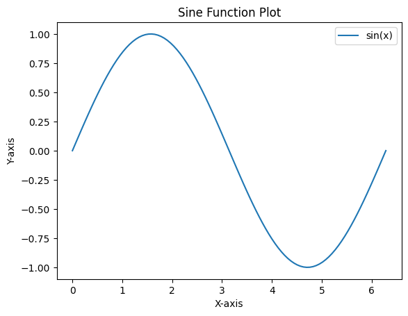

#  "Sine-function"
## About
 This repository provides a simple `sine function` plotting example for [REANA](https://www.reanahub.io/) reusable research data analysis platform.
## Structure
To run a REANA workflow, you typically need the following files:
### 1.**Source code**

To create a simple `sine function` plotting example for a REANA reusable research data analysis platform, you can use this Python script saved as `sine_plot.py`.

### 2.**Environment Requirements**
It's important to choose an environment that includes all the necessary dependencies for the specific task at hand. If custom environments are needed, you can create your own Docker images and use them in the environment specification.  

 Here we are `docker.io/library/python:3.10-bookworm` which has all the libraries we want to run this specific workflow. The environment section in our REANA workflow YAML file indicates the Docker image to be used for running your Python script.

### 3.**Workflow Specification (YAML)**:
This file describes the structure and steps of your workflow. It includes information about input data, steps to be executed, and any necessary parameters. The default name is often **reana.yaml**.

``` 
version: 0.9.0
inputs:
  files:
    - sine_plot.py
workflow:
  type: serial
  specification:
    steps:
      - environment: 'docker.io/library/python:3.10-bookworm'
        commands:
          - python sine_plot.py
outputs:
  files:
    - sine_plot.png


```

## Running the Example  
Since you have all the file to run your work in REANA,follow these steps to run your workflow:

 ###### 1.Test the connection
``` 
$ reana-client ping

```
 ###### 2.Create a  new workflow

```
$ reana-client create -n sine

```
 ###### 3.Set the reana environment variable
```
$ export REANA_WORKON=sine

```
 ###### 4.Upload input code and workflow to the workspace
```
$ reana-client upload

```
 ###### 5.Start the workflow
```
$ reana-client start

```
 ###### 6.Check workflow status
```
$ reana-client status

```
 ###### 7.Check logs and output
```
$ reana-client logs

```
After running the analysis through REANA, we can download the results with
```
$ reana-client download sine_plot.png

```
Running this workflow should give you a sin function plot:




