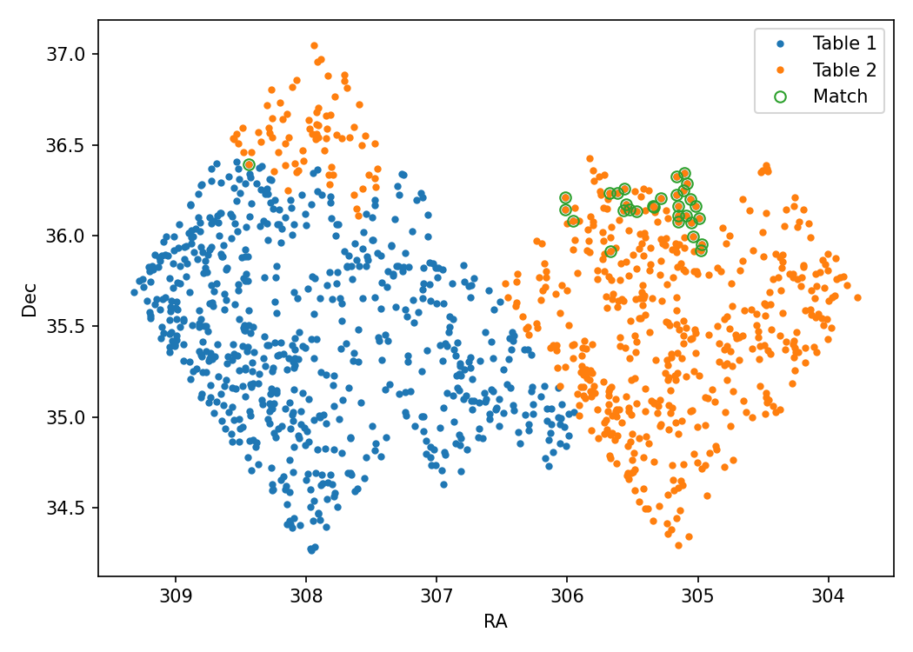

# Upload & Download files
## About
This example shows how to upload all files needed for the analysis (e.g. a catalog) and download useful outputs (e.g. a plot or a table).

## Structure
### 1. Input dataset
The input files are 2 CSV tables containing of a list of stars with different parameters, like their (RA,Dec) coordinates on the sky. The tables are in the files **gaia_table_1.csv** and **gaia_table_2.csv** that we need to read at the beginning of the analysis.

### 2. Source code
In the file **up_down.py** we perform the following steps:
- reading the 2 tables using the python library `pandas`
- matching them to find common objects (using the column “source_id”)
- plotting and saving the results
- saving a table with common objects in a new file

### 3. Environment
For this analysis to run we need two python libraries, `pandas` to read, match, and write the tables, and `matplotlib.pyplot` to make the plot. We can use the Docker image `jupyter/scipy-notebook` which already contains them both.

### 4. Workflow
The code in **up_down.py** takes care of the steps described above:

```
import pandas as pd
import matplotlib.pyplot as plt

# Read the result of 2 Gaia queries with pandas
table1 = pd.read_csv('gaia_table_1.csv')
table2 = pd.read_csv('gaia_table_2.csv')

# Find common objects
table_match = pd.merge(table1, table2, on='source_id')

# Create and save plot of the results
fig, ax = plt.subplots(1,1, figsize=(7,7))
ax.plot(table1.ra, table1.dec, '.', label='Table 1')
ax.plot(table2.ra, table2.dec, '.', label='Table 2')
ax.plot(table_match.ra_x, table_match.dec_x, 'o', mfc='None', label='Match')
ax.invert_xaxis()
ax.set_xlabel('RA')
ax.set_ylabel('Dec')
ax.legend()
fig.tight_layout()
plt.savefig('results/table_match.png', format='png', dpi=150)

# Save the results in a new table
table_match.to_csv('results/table_match.csv', index=False)
```

### 5. Output results
The example produces two new files:
- **table_match.png** containing a plot with the 2 original datasets and the common objects
- **table_match.csv** containing a new dataset with the common objects only

## Running the example on REANA
In this example we have both input and output files, so we need to include them in the **reana.yaml** file:

```
inputs:
  files:
    - up_down.py
    - gaia_table_1.csv
    - gaia_table_2.csv
workflow:
  type: serial
  specification:
    steps:
      - environment: 'jupyter/scipy-notebook'
        commands:
        - mkdir -p results
        - python up_down.py
outputs:
  files:
    - results/table_match.png
    - results/table_match.csv
```

Notice that in the “command” section we can include any useful shell commands, e.g. making a new directory to save the results, like in this case.  

After running the analysis through REANA, we can download the results with:  
`reana-client download results` and obtain something like this plot.

{width=50%}
