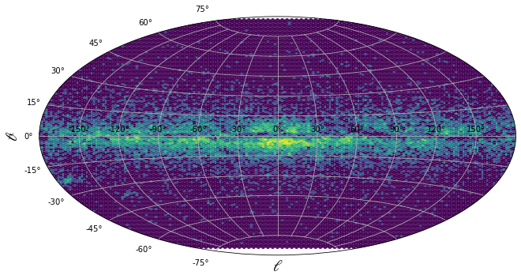

# Access remote data
## About
This example shows how to get data from a remote database, in this case the AIP StarHorse data described here: [SH_2021](https://data.aip.de/projects/starhorse2021.html).

## Structure
### 1. Input dataset
We access an S3 storage to get the first 10 files (as an example) and save them in a Pandas dataframe. The available columns are:
- Gaia EDR3 source identifier: `'ID'`
- galactic longitude: `'glon'`
- galactic latitude: `'glat'`
- age percentiles: `'age05', 'age16', 'age50', 'age84', 'age95'`
- mass percentiles: `'mass16', 'mass50', 'mass84'`
- effective temperature percentiles: `'teff16', 'teff50', 'teff84'`
- surface gravity percentiles: `'logg16','logg50', 'logg84'`
- metallicity percentiles: `'met16', 'met50', 'met84'`
- distance percentiles: `'dist05', 'dist16','dist50', 'dist84', 'dist95'`
- line-of-sight extinction percentiles: `'AV05', 'AV16', 'AV50', 'AV84', 'AV95'`
-  number of stellar models: `'nummodels'`

For a full description, check the related documentation or paper ([Anders et al., 2021](https://arxiv.org/pdf/2111.01860.pdf)).

### 2. Source code
In the file **remote_data.py** we perform the following steps:
- loading the remote data
- saving the tables in a `pandas` dataframe
- reading the galactic coordinates using `astropy.coordinates`
- plotting and saving a figure with all sources using an aitoff projection

### 3. Environment
For this analysis to run we need many libraries included at the beginning of the source file, so we can use an environment based on `jupyter/scipy-notebook` with some additional libraries useful for astronomical data handling.

### 4. Output results
The example produce a new file with the figure, saved in **galactic_plot.png**.

## Running the example on REANA
In this example we have both input and output files, so we need to include them in the **reana.yaml** file:

```
inputs:
  files:
    - remote_data.py
workflow:
  type: serial
  specification:
    steps:
      - environment: 'gitlab-p4n.aip.de:5005/p4nreana/reana-env:py311-astro.9845'
        commands:
        - mkdir -p results
        - python remote_data.py
outputs:
  files:
    - results/galactic_plot.png

```

After running the analysis through REANA, we can download the results folder with:  
`reana-client download results` and obtain something like this plot.  

{width=50%}
